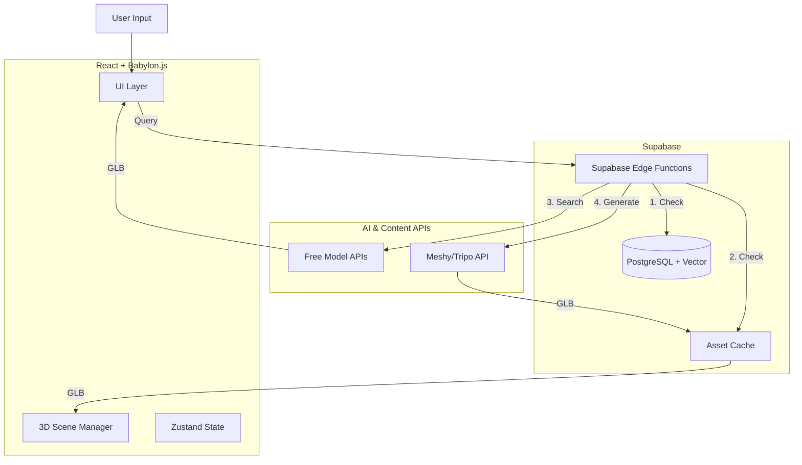

# OBVIAN 2.0 - Web Architecture & Development Plan

## 🎯 Vision
To build a scalable, web-first immersive learning platform where students can explore concepts through interactive 3D experiences generated by AI or sourced from vast libraries.

---

## 🏗️ Tech Stack & Justification

### 1. Frontend Framework: **React 18 + Vite + TypeScript**
*   **React**: The industry standard for component-based UIs. V2 introduces specialized 3D components (`BabylonViewer`) that interact with standard UI overlays.
*   **Vite**: Chosen for its lightning-fast Hot Module Replacement (HMR) and build speeds, crucial for rapid prototyping.
*   **TypeScript**: Mandatory for maintaining complex 3D state, vector math, and strictly typed API responses.

### 2. 3D Engine: **Babylon.js**
*   **Why not Three.js?**
    *   **Batteries Included**: Babylon includes collisions, physics, and best-in-class glTF support out of the box.
    *   **Web-First**: Designed specifically for the web with excellent backward compatibility.
    *   **TypeScript Native**: Better developer experience with types.
    *   **Microsoft Backing**: Long-term stability for an educational platform.

### 3. State Management: **Zustand**
*   **Recommendation**: Move from simple `useState` to `Zustand` for global app state.
*   **Why?** 3D apps have high-frequency state changes (camera position, loading progress) that cause unnecessary re-renders in React Context. Zustand allows transient updates (updating state without triggering render) which is critical for 60FPS performance.

### 4. Backend & Database: **Supabase**
*   **Why Supabase over Custom Node/Express?**
    *   **Speed**: Provides Auth, Database (PostgreSQL), and Realtime subscriptions instantly.
    *   **Vector Support**: `pgvector` is built-in, allowing us to store **embeddings** of our 3D models for semantic search (e.g., searching "scary animal" finds "spider model").
    *   **Edge Functions**: Perfect for proxying AI API calls (FLUX/Meshy) to hide API keys.

### 5. AI & Asset Pipeline (The "Hybrid" Engine)
We use a waterfall approach to balance cost, speed, and quality:
1.  **L1: Cache Layer** (Supabase Storage): Check if we've generated this before. (Cost: $0, Speed: Instant)
2.  **L2: Library Layer** (Sketchfab/Poly Pizza/NASA): Search open APIs for high-quality human-made models. (Cost: $0, Speed: Fast)
3.  **L3: AI Generation Layer** (Fallback):
    *   **Current Best Option**: **Meshy.ai** or **TripoSR**.
    *   *Reasoning*: FLUX is an image generator. While excellent for text-to-image, turning that image into 3D requires a second step (Image-to-3D). Specialized services like Meshy or Tripo handle Text-to-3D directly with better topology.

---

## 📐 Architecture Diagram

---

## 🚀 Roadmap & Implementation Plan

### Phase 1: Foundation (Completed ✅)
- [x] Project setup (Vite + React + TS).
- [x] Babylon.js integration.
- [x] Basic First-Person Controller (WASD + Look).
- [x] "Hybrid" Asset Pipeline Service (Mock).
- [x] UI/UX Skeleton.

### Phase 2: Intelligence (Current Focus 🚧)
- [ ] **Auth System**: Set up Supabase Auth (Google/Email).
- [ ] **Real AI Integration**: Replace mocks with **Meshy.ai** (Text-to-3D) API.
- [ ] **Library Integration**: Connect to **Sketchfab Data API** (requires key) or similar free index.
- [ ] **Annotation System**: Use Gemini 1.5 Flash (fast/cheap) to generate "Fun Facts" and labels for loaded models.

### Phase 3: Interactivity (Next)
- [ ] **Raycasting**: Click on parts of a model to identify them (requires semantic segmentation or simply clicking the whole object).
- [ ] **Gamification**: "Quizzes" where users must find an object in the scene.
- [ ] **Multiplayer**: (Stretch Goal) Use Supabase Realtime to see other cursors/avatars.

### Phase 4: Optimization & Polish
- [ ] **Draco Compression**: Compress 3D models to reduce load size by 80%.
- [ ] **Level of Detail (LOD)**: Swap high-poly AI models for simple ones when far away.
- [ ] **PWA Support**: Install as an app on iPad/Android.

---

## 💡 Key "Best Practice" Decisions

1.  **Draco Compression**:
    *   *Why*: AI models are often unoptimized (large file size). We must use Draco compression in our pipeline to ensure students on school WiFi can load them.

2.  **Vector Search**:
    *   *Why*: Instead of exact text matching (Query: "Big cat"), we use vector embeddings to match concepts (Result: "Lion"). This makes the library search significantly more effective.

3.  **Edge Caching**:
    *   *Why*: If Student A generates a "Cell Model", Student B should get that cached model instantly next time. We will use a "Global Cache" strategy.

## 🔗 Resource Links
*   **3D Gen**: [Meshy.ai API](https://meshy.ai) (Best balance of speed/quality).
*   **Database**: [Supabase](https://supabase.com).
*   **Engine Docs**: [Babylon.js Documentation](https://doc.babylonjs.com).

